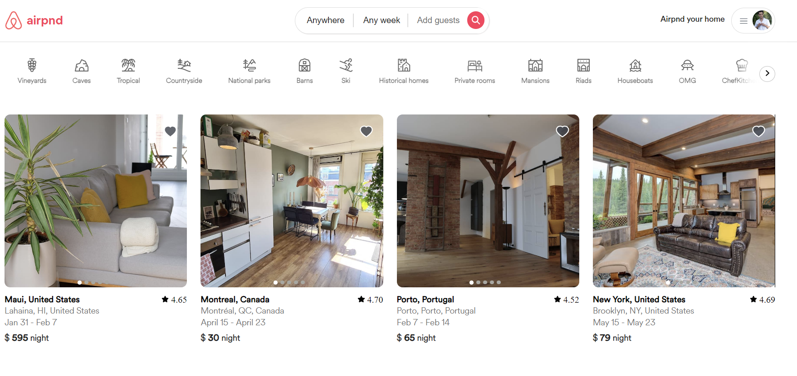
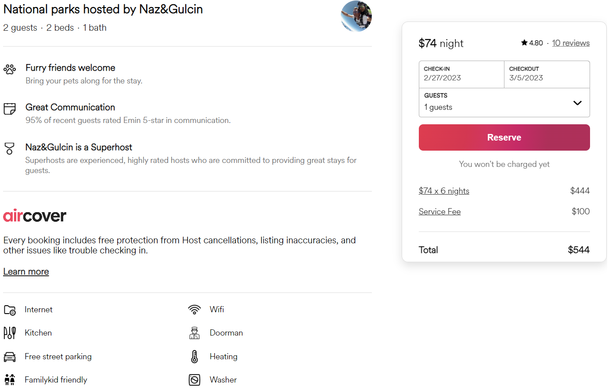
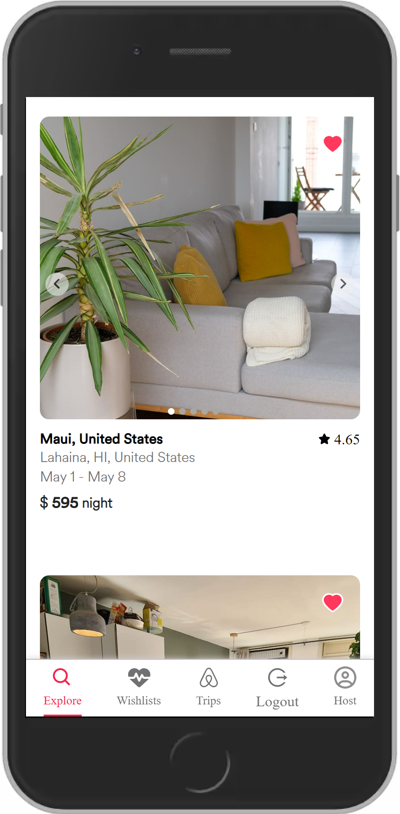
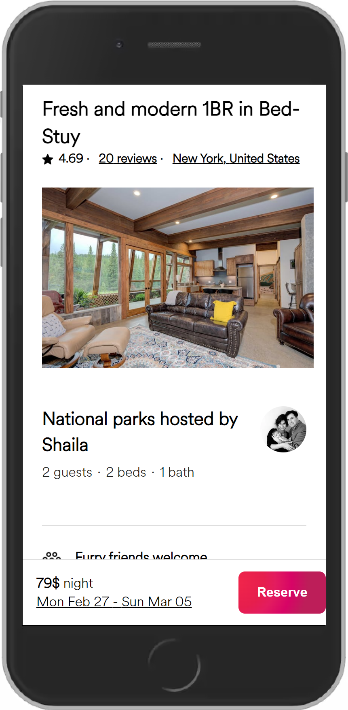
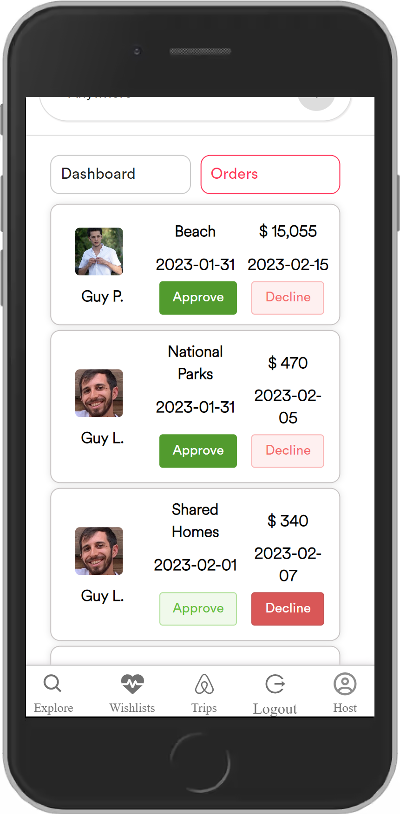

# Airpnd

Airpnd is a web application that allows users to find and rent apartments, similar to Airbnb. This project was the final project in my Bootcamp.
## Introduction

The purpose of this app is to provide users with a simple and user-friendly way to find and rent apartments. We built this app to learn new technologies and expand our knowledge and skills.
## Features

- Simple authentication using session storage and HTTP requests for MongoDB Atlas data
- Filter apartments by name, location, and labels
- CRUDL operations for apartment orders, along with user messages for different actions
- Responsive and well-designed user interface


## Installation

To run this app locally on your computer, follow these steps:

```bash
Clone the project or download the files
```
```bash
Navigate to the /backend directory and run npm i && npm run dev
```
```bash
Navigate back to the main directory and then to the /frontend directory and run npm i && npm start
```

    
## Screenshots
### Home page
You can view different kinds of stays, filter them by name or location (city or state), and even by labels. In addition, you can add or remove people from your order and change the dates.


### Stay details



### Confirm your order


### Mobile view
We used conditional rendering and a "mobile-first" approach to make the app responsive on mobile devices. The footer menu is also interactive for routing.




## Authors
- [@Guy Peer](https://github.com/GuyPeer1)
- [@Ofek Ashkenazi](https://github.com/OfekAshkenazi/)
- [@Guy Lazarof](https://github.com/guy-lazarof)
